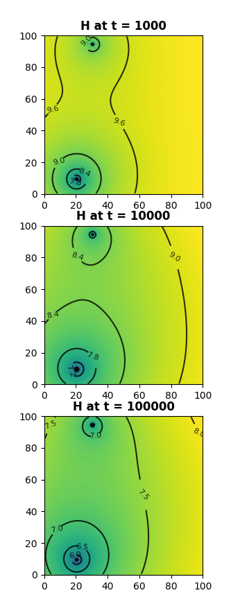

# HyQ - Simple Groundwater Models in Python

## About
HyQ is a python model for fast and simple prototyping of basic single-aquifer
groundwater-models. You define a model grid, some aquifer parameters, the position
and pumping rates of some wells and the points in time at which you want to model.
At it's core, HyQ uses the 
[Theis Well Equation](https://en.wikipedia.org/wiki/Aquifer_test#Transient_Theis_solution)
to solve the impact of a pumping well
on the aquifers head: well by well, gridcell by gridcell, and for each point in time.

## Table of Contents

- [Installation](#Installation)
- [Disclaimer](#Disclaimer)
- [Raison d'Être](#raison-dêtre)
- [Features](#Features)
- [Example](#Example)

## Installation
`hyq` the python package is not yet on pip, but you are welcome to clone this repo and install
build the source. `hyq` has a couple of dependencies 
([c.f. the projects setup.cfg](https://github.com/Ignimbrit/HyQ/blob/main/setup.cfg))
but most should be taken care of by pip. Notable exception is `GDAL`, which might require
some extra steps.

The following specific instructions assume you have set up your project and a clean virtual environment, 
that you have installed GDAL successfully and have downloaded the contents of this repo. Now just navigated
into the folder wherever you saved `hyq` and type

```commandline
pip install .
```

### Installing GDAL on Linux
On Linux, the most laborious part is setting up GDAL to work both outside and inside python.
Personally I liked [the instructions given here](https://mothergeo-py.readthedocs.io/en/latest/development/how-to/gdal-ubuntu-pkg.html).
Follow them and make sure `from osgeo import gdal`
works in your python environment.

### Installing GDAL on Windows
I haven't tried personally, but rumor has it, [OS4Geo](https://trac.osgeo.org/osgeo4w/) is supposed to do that

## Disclaimer
`hyq` is a personal project written for my own entertainment and education. If you find value in it, 
you are welcome. Note however, that this package comes with no warranty, no liability, is provided "as is"
and should not be used in production because it has not been sufficiently tested and validated. 

Beware also that `hyq` is in an early stage of its development, meaning the API could change.

## Raison d'Être
The hydromechanical and geochemical processes taking place in groundwater are complex. There are [software-suites
trying to make it possible](https://www.usgs.gov/mission-areas/water-resources/science/modflow-and-related-programs)
to model all of these using finite differences (or finite elements) methods,
and they are honestly impressively good at that, but they are notoriously difficult to learn and master.

On the other hand, many day-to-day assessments of the situation in an aquifer, especially related to short term
environmental impacts of temporary groundwater extraction, can be handled with reasonable precision by much simpler 
methods. Analytical equations to calculate the impact of pumping wells on the aquifer head have been around 
for almost 100 years, and solving these on a (long) piece of paper or a dedicated spreadsheet is still
"industry-standard" in many places.

`hyq` aims to push into that gap in order to provide a simple infrastructure to make simple models quick and painless.

## Features
The amount of things `hyq` can do is limited, or, positively phrased, focused. If you need a fully fledged
groundwater-modelling-toolchain check out [flopy](https://github.com/modflowpy/flopy)! What `hyq` does offer is:

- Fully real-world spatial grid models
- Support for one (1) single aquifer, confined or unconfined
- Adding as many (fully penetrating) wells as your cpu can handle
- Same goes true for points in time
- Direct visual feedback with internal plotting method
- Exporting resulting head calculations as raster to .tiff
- Exporting resulting head calculations as contour vectors to geopackage

## Example
### Model setup and run
For this example we set up a very simple model using table coordinates (the lower-left corner has coordinates (0, 0)).
The model shall be a square of 100 m length and have a resolution of 1x1 m grid cells.

```python
import hyq

# The first step is to initialize the model object
mymod = hyq.GWModel()

# Next we define the spatial properties of our simulation grid
mymod.set_grid(
    x_min = 0, # left border easting
    y_max = 100, # upper border northing
    len_x= 100, # width of the model space [m] 
    len_y = 100, # height of the model space [m]
    res_x=1, # width of a grid cell [m]
    res_y=1, # height of a grid cell [m]
    crs = None # spatial coordinate reference system
)
```

Now that the model is located in space, we can insert some (fully penetrating) pumping wells. For this example
let's add two.

```python
# define a well
mywell = hyq.well(
    ID ="testwell", # some identifying string
    x = 20, # easting
    y = 10, # northing
    Q = 0.1 # the pumping rate in m³/s (SI units!)
)

# defina another well
mywell2 = hyq.well(ID ="testwell2", x = 30, y = 95, Q = 0.05)

# Add the wells to the model object
mymod.add_wells(mywell, mywell2)
```

Finally, before we start the calculations, we need to tell the model about the hydrophysical properties of its aquifer
(there only ever is one single aquifer with `hyq`).

```python
# define aquifer behaviour
mymod.set_aquiferparams(
    H0 = 10, # Initial head above aquitard (uniform over the entire grid (yes, a simplification, obviously)
    T = 0.02, # Transmissivity [m²/s]
    S = 0.05, # Storativity [dimensionless
    M = 10, # Thickness of the aquifer
    confined=False # whether this is an confined aquifer (it's not, in this example)
)

# Tell the model at what times we wish to inspect the heads
mymod.set_timesteps([1000, 10000, 100000]) # Points in time as seconds after pumping started
```

That's it. The model is completely constrained. We can run ist and check teh results:
```python
# This tells hyq to actually calculate things
mymod.run()

# If the calculation is
mymod.plot()
```

The result of that last plot should return this plot:



### Exporting model results to file

You can save the rasters shown in the plot above as a tiff file. This will result in a single
file with multiple bands - one for each timestep.

```python
mymod.export_head("~/test1_heads.tiff")
```

Alternatively/Additionally, you can calculate contours and save them in a GeoPackage
```python
mymod.export_contours_head(
    gpkgpath="~/contourtest.gpkg",
    levels = [6, 7, 8, 8.5, 9, 9.25, 9.5, 9.75]
)
```

### Accessing model results from within python

Results created by a call to `hyq.GWModel.run()` are saved as `numpay.array`s in a list called `H`.
This is python, no ones stopping you from accessing that list. To retrieve e.g. the array
representing the modeled head for the first timestep in our example, just do:

```python
res_1 = mymod.H[0]
```
